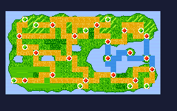
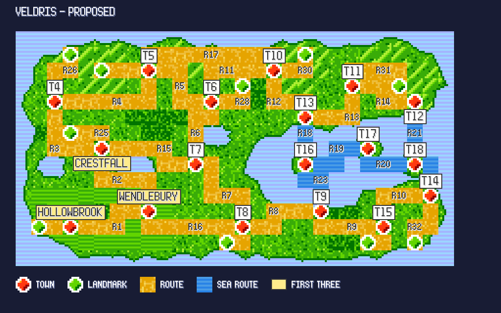
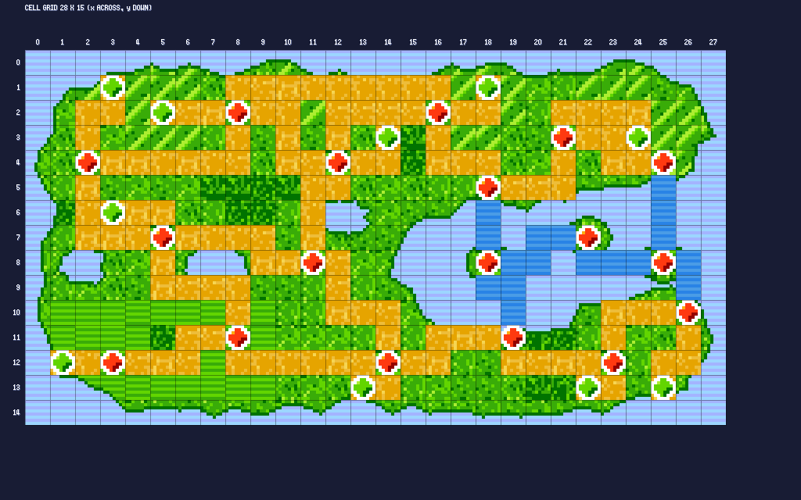

# Region map and fly destinations

How a map gets onto the town map and becomes a fly destination in this tree. Everything below was traced in the source of this repository (file names and function names given), except where marked **unverified**.

## What I could not read

Two sources were requested and the environment's network policy blocked both hosts:

- `huderlem.github.io` (Porymap's Region Map Editor manual)
- `www.pokecommunity.com` (the "Guide to Editing the Region Map" thread)

So **nothing here is taken from those pages.** Anything about what Porymap's Region Map Editor does with these files is marked **unverified**. To let me read them, add those two hosts under Network access in the environment settings.

## The town map and fly, in plain language

The **town map** (Pokénav's region map) and the **Fly** picker are the same screen and the same data. Six pieces connect a map to them:

1. **Each map names its section.** Every `data/maps/<Map>/map.json` has `"region_map_section": "MAPSEC_..."`. A section is a named place: a town, a route, a cave. A town and all its houses can share one section. The name popup when you enter a map comes from this too.
2. **Each section has a record.** `src/data/region_map/region_map_sections.json` holds, per section: `id`, `name` (what the player sees), and `x`, `y`, `width`, `height` (where it sits on the map, in cells). The build turns this file into the `MAPSEC_*` list (`include/constants/region_map_sections.h`) and the `gRegionMapEntries` table. Do not edit those two generated files.
3. **A grid says which cell belongs to which section.** `sRegionMap_MapSectionLayout[15][28]` in `src/data/region_map/region_map_layout.h`. The cursor moves cell by cell and shows the name of the section in the cell it is on. The `x/y/width/height` in step 2 must agree with this grid.
4. **The picture is separate.** What you see is drawn from 8x8 tiles: `graphics/pokenav/region_map/map.png` (the tile sheet, 128x120, 8-bit indexed), `map.bin` (the tilemap: 4096 bytes, one byte per tile position) and `map.pal`. **A byte holds only 256 different tile numbers, so the picture can use at most 256 distinct 8x8 tiles.** Hoenn's uses 233. So the picture, the grid and the JSON are three things kept in step, not one.
5. **Whether a town can be flown to is decided in C, not data.** Three places in `src/region_map.c`:
   - `GetMapsecType()` is a `switch` that says "this section is a city, and it is flyable once *this flag* is set". Any section not listed there is treated as a plain route.
   - `sFlyLocations[]` is the list of fly icons: region, flag, section.
   - `sMapHealLocations[]` (plus `FilterFlyDestination()`) says where you land. Normally it is a **heal location** from `src/data/heal_locations.json`, the spot outside the Pokémon Center. Failing that, it uses the map's warp.
6. **The visited flag is set by the town's own script.** For example `LittlerootTown_OnTransition` runs `setflag FLAG_VISITED_LITTLEROOT_TOWN` (`data/maps/LittlerootTown/scripts.inc`). Until that runs, the town shows on the map but cannot be flown to.

Which region map you get (Hoenn, Kanto, Sevii) comes from the section's number: sections in the Kanto block (`KANTO_MAPSEC_START` to `KANTO_MAPSEC_END`) use the Kanto map, and **anything else uses the Hoenn map** (`GetRegionMapType`). Veldris will therefore use the Hoenn map, and new sections must go at the **end** of the JSON list, never inside the Kanto block.

## What this means for Veldris

**Data only (no C):** section names, positions, the grid, the picture, heal locations, and each map's `region_map_section`.

**C edits, three small ones per fly town, all in `src/region_map.c`:** a `GetMapsecType` case, an `sFlyLocations` entry and an `sMapHealLocations` entry. Alongside those, the data side needs a claimed visited flag ([flags.md](flags.md)), a heal location in `src/data/heal_locations.json`, and the town's `OnTransition` setting the flag. Routes need no C: an unlisted section is a route.

**Limits found:**

- **Map sections are 8-bit and share their value space with `0xFD-0xFF`** (special met-location codes). 209 sections already exist, so **at most 43 more fit.** Veldris wants 51 (18 towns and 33 routes) before any caves or landmarks. So at least 8 sections have to reuse the IDs of vanilla sections we no longer need (rename their record only), or vanilla content has to be stripped later. Not blocking the first 3 towns and 3 routes.
- **Popup themes.** `sMapSectionToThemeId` in `src/map_name_popup.c` sets each section's popup style. New sections default to theme 0 until a line is added.
- **Name clashes.** FRLG already owns `MAPSEC_ROUTE_1` to `MAPSEC_ROUTE_25`. See [towns-and-routes.md](towns-and-routes.md). The FRLG maps themselves are not built into this Emerald ROM (`mapjson` skips every map not tagged `REGION_HOENN`), but their `MAP_*` and `MAPSEC_*` constants still exist as placeholders.
- **Tile budget.** At most 256 distinct 8x8 tiles in the picture (see piece 4). The finished art has to reuse tiles heavily: repeating sea, grass and mountain tiles and a small set of coast and road pieces.
- **Names** are at most 16 characters, charmap characters only (no double quote).
- **Heal locations.** Each flyable section needs a row in `sMapHealLocations`, which is indexed by section number (a gap row is all zeros). The build also rewrites `heal_locations.json` when a heal location's `respawn_map` does not exist yet, so add a heal location only after its Pokémon Center map exists.
- **Fly is gated.** In this build Fly needs the Feather Badge (`src/field_move.c`), and a town only becomes flyable after the player has walked into it once (its `OnTransition` sets the flag). To test flying between the first three towns early, use the debug menu, or point `OW_FLAG_POKE_RIDER` (`include/config/overworld.h`) at a spare flag, which lets you open the fly map from the Pokénav without the HM. The config route is untested in game.
- **No city zoom picture is needed.** A new town simply shows none (`NUM_CITY_MAPS` is 22), which is not a blocker.

## Checklist: add one fly town

1. Author (Porymap): make the map. Set `region_map_section` to the town's section.
2. Add the section record to the **end** of `region_map_sections.json` (id, name, x, y, width, height).
3. Update the grid and the picture so the new cell shows the town (author, Region Map Editor; **unverified** that the editor covers all three files).
4. Add a heal location in `src/data/heal_locations.json`.
5. Claim a visited flag ([flags.md](flags.md), log it in [engine-edits.md](engine-edits.md)).
6. `src/region_map.c`: add the `GetMapsecType` case, the `sFlyLocations` entry and the `sMapHealLocations` entry.
7. Town's `OnTransition` script: `setflag <the flag>`.
8. `make -j4`, then fly there in an emulator.

## Decision needed before the first fly town (PROPOSED default: A)

| | A. Add new sections and edit the C tables | B. Reuse an unused Hoenn town's slot |
|---|---|---|
| C edits | 3 small ones per town | None |
| Names | Clean (`MAPSEC_HOLLOWBROOK`, own flag) | Hoenn-named (`Hollowbrook` would sit in `MAPSEC_OLDALE_TOWN` and set `FLAG_VISITED_OLDALE_TOWN`) |
| Section budget | Uses up the 43 spare IDs | Saves them |
| Fits 18 towns? | Yes, until IDs run out | Only about 14 slots, since Littleroot and Ever Grande have special cases |

Recommendation: **A**, and reuse vanilla IDs for the remainder once the spare IDs are gone.

---

# Veldris layout proposal (PROPOSED, not approved)

**Version 3.** The same organic shape as version 2 (a crescent of land around an inland bay, placeholder name Marrow Bay), redrawn in the style of the game's own town map and of the example you sent: striped sea, textured green land, wide bands for routes, round markers for towns. It replaces the lattice of version 1 and the thin smooth roads of version 2.

**The picture as it would sit in the game** (native 256x160, no text baked in):



**Labelled, with the game's own font** ([open it full size](veldris-layout-annotated.png)). The first three towns have gold plates. Other towns are T4 to T18, and routes are R1 to R33:



**The 28 x 15 cell grid the game stores**, with coordinates, for the Region Map Editor step ([full size](veldris-layout-cells.png)):



## Style and names

- **Style.** Striped sea, textured land, **orange bands** for land routes, **blue bands** for sea routes, **red round markers** for towns, **green markers** at the end of each side path (a cove, a cave mouth). The colours are taken from vanilla's own town-map palette (16 colours, where Hoenn's picture uses 27). The colour meanings are proposals. Your example uses pink rectangles for cities and green squares for landmarks, and recolouring to that is a palette change.
- **Town names use the GBA font automatically.** They are not part of the picture. The engine prints the name of the section under the cursor at run time, in `FONT_NORMAL` (the game's font), into its own name windows (`WIN_MAPSEC_NAME` and `WIN_MAPSEC_NAME_TALL` in `src/region_map.c`). So there is nothing to draw and nothing to match. The labelled image above is drawn with the game's own font sheets (`graphics/fonts/latin_normal.png` and `latin_small.png`, glyph widths from `src/fonts.c`) so you can see how the names read. The plates are for the mockup only.
- **Names** are at most 16 characters, in capitals like vanilla (`LITTLEROOT TOWN`), and charmap characters only. The names on the plates for towns 4 to 18 are placeholders.

## Why it is not a grid

- **The picture and the cells are separate things.** The picture is painted from 8x8 tiles, so the coastline, islands and lakes can be any shape. The 28 x 15 cells only tell the game which section the cursor is on. The grid is never drawn in the game.
- Towns sit where the land wants them, not on a lattice. Routes wind around lakes, forest and mountains as bands of touching cells, the way vanilla's routes do.
- **"Zoomed out":** each cell stands for a big stretch of land, so a town is one cell and a route is a few bent cells. The 28 x 15 size itself is fixed by the engine (`MAP_WIDTH` and `MAP_HEIGHT` in `src/region_map.c`). If you meant a bigger map area than that, it needs an engine edit, so say so and I will look at what it costs.

## Numbers

- 18 towns and 33 routes: **23 links between towns** (17 on land, 6 by sea) and **10 side paths** that dead-end (a lane into the hills, a cove). 155 of the 420 cells are used.
- Checked by script: every route sits on the right terrain (land or sea), routes never overlap, every route touches its towns, every town is reachable from town 1, and no town has more than 4 routes (a town is one cell, so only its 4 neighbours can hold a route).
- Numbers are placeholders. Only routes 1 to 3 are meaningful: town 1 to 2, town 2 to 3 (Crestfall), and town 3 onwards to town 4, which stays blocked at first.
- **Section budget:** 51 sections against about 43 spare IDs. See "Limits found" above. The first 6 fit easily.
- **Tile budget (measured):** the picture uses **148 distinct 8x8 tiles** in the map area against the limit of 256 (vanilla Hoenn uses 215), and 16 colours. It is built from a handful of repeating patterns (land, forest, mountain, farm, route, sea) plus the coast tiles, so it fits. Version 2's smooth coast and roads needed 324 and would not have. It is still a mockup: the real picture is painted with tiles in the Region Map Editor.
- A winding route's rectangle is the bounding box of its cells, exactly as Hoenn does it (52 of Hoenn's 54 section rectangles equal the bounding box of their cells; Route 114 is a 4-cell bend inside a 2x3 box). The player marker is placed inside that box, so on a bent route it may not sit exactly on the road. Untested in game.
- The labelled image leaves off the numbers of R22, R24, R27, R29 and R33, which are too short to fit a label. The tables below list every route.

## Section list

`x`, `y`, `w`, `h` are in cells and are what `region_map_sections.json` needs. Names are placeholders. The full cell lists are in [`veldris-layout.json`](veldris-layout.json), reference data for entering the cells by hand (nothing reads it at build time).

| # | Section id | Name shown | x | y | w | h | Cells | Status |
|---|---|---|---|---|---|---|---|---|
| T1 | `MAPSEC_HOLLOWBROOK` | HOLLOWBROOK | 3 | 12 | 1 | 1 | 1 | **build first** |
| T2 | `MAPSEC_WENDLEBURY` | WENDLEBURY | 8 | 11 | 1 | 1 | 1 | **build first** |
| T3 | `MAPSEC_CRESTFALL` | CRESTFALL | 5 | 7 | 1 | 1 | 1 | **build first** |
| T4 | `MAPSEC_VELDRIS_TOWN_04` | TOWN 04 | 2 | 4 | 1 | 1 | 1 | planned |
| T5 | `MAPSEC_VELDRIS_TOWN_05` | TOWN 05 | 8 | 2 | 1 | 1 | 1 | planned |
| T6 | `MAPSEC_VELDRIS_TOWN_06` | TOWN 06 | 12 | 4 | 1 | 1 | 1 | planned |
| T7 | `MAPSEC_VELDRIS_TOWN_07` | TOWN 07 | 11 | 8 | 1 | 1 | 1 | planned |
| T8 | `MAPSEC_VELDRIS_TOWN_08` | TOWN 08 | 14 | 12 | 1 | 1 | 1 | planned |
| T9 | `MAPSEC_VELDRIS_TOWN_09` | TOWN 09 | 19 | 11 | 1 | 1 | 1 | planned |
| T10 | `MAPSEC_VELDRIS_TOWN_10` | TOWN 10 | 16 | 2 | 1 | 1 | 1 | planned |
| T11 | `MAPSEC_VELDRIS_TOWN_11` | TOWN 11 | 21 | 3 | 1 | 1 | 1 | planned |
| T12 | `MAPSEC_VELDRIS_TOWN_12` | TOWN 12 | 25 | 4 | 1 | 1 | 1 | planned |
| T13 | `MAPSEC_VELDRIS_TOWN_13` | TOWN 13 | 18 | 5 | 1 | 1 | 1 | planned |
| T14 | `MAPSEC_VELDRIS_TOWN_14` | TOWN 14 | 26 | 10 | 1 | 1 | 1 | planned |
| T15 | `MAPSEC_VELDRIS_TOWN_15` | TOWN 15 | 23 | 12 | 1 | 1 | 1 | planned |
| T16 | `MAPSEC_VELDRIS_TOWN_16` | TOWN 16 | 18 | 8 | 1 | 1 | 1 | planned |
| T17 | `MAPSEC_VELDRIS_TOWN_17` | TOWN 17 | 22 | 7 | 1 | 1 | 1 | planned |
| T18 | `MAPSEC_VELDRIS_TOWN_18` | TOWN 18 | 25 | 8 | 1 | 1 | 1 | planned |
| R1 | `MAPSEC_VELDRIS_ROUTE_1` | ROUTE 1 | 4 | 11 | 4 | 2 | 5 | **build first** |
| R2 | `MAPSEC_VELDRIS_ROUTE_2` | ROUTE 2 | 5 | 8 | 4 | 3 | 6 | **build first** |
| R3 | `MAPSEC_VELDRIS_ROUTE_3` | ROUTE 3 | 2 | 5 | 3 | 3 | 5 | **build first** |
| R4 | `MAPSEC_VELDRIS_ROUTE_4` | ROUTE 4 | 3 | 3 | 6 | 2 | 7 | planned |
| R5 | `MAPSEC_VELDRIS_ROUTE_5` | ROUTE 5 | 9 | 2 | 3 | 3 | 5 | planned |
| R6 | `MAPSEC_VELDRIS_ROUTE_6` | ROUTE 6 | 11 | 5 | 2 | 3 | 4 | planned |
| R7 | `MAPSEC_VELDRIS_ROUTE_7` | ROUTE 7 | 12 | 8 | 3 | 4 | 6 | planned |
| R8 | `MAPSEC_VELDRIS_ROUTE_8` | ROUTE 8 | 15 | 11 | 4 | 2 | 5 | planned |
| R9 | `MAPSEC_VELDRIS_ROUTE_9` | ROUTE 9 | 19 | 12 | 4 | 1 | 4 | planned |
| R10 | `MAPSEC_VELDRIS_ROUTE_10` | ROUTE 10 | 23 | 10 | 3 | 2 | 4 | planned |
| R11 | `MAPSEC_VELDRIS_ROUTE_11` | ROUTE 11 | 12 | 2 | 4 | 2 | 5 | planned |
| R12 | `MAPSEC_VELDRIS_ROUTE_12` | ROUTE 12 | 16 | 3 | 3 | 2 | 4 | planned |
| R13 | `MAPSEC_VELDRIS_ROUTE_13` | ROUTE 13 | 19 | 4 | 3 | 2 | 4 | planned |
| R14 | `MAPSEC_VELDRIS_ROUTE_14` | ROUTE 14 | 22 | 3 | 3 | 2 | 4 | planned |
| R15 | `MAPSEC_VELDRIS_ROUTE_15` | ROUTE 15 | 6 | 7 | 5 | 2 | 6 | planned |
| R16 | `MAPSEC_VELDRIS_ROUTE_16` | ROUTE 16 | 8 | 12 | 6 | 1 | 6 | planned |
| R17 | `MAPSEC_VELDRIS_ROUTE_17` | ROUTE 17 | 8 | 1 | 9 | 1 | 9 | planned |
| R18 | `MAPSEC_VELDRIS_ROUTE_18` | ROUTE 18 | 18 | 6 | 1 | 2 | 2 | planned (sea route) |
| R19 | `MAPSEC_VELDRIS_ROUTE_19` | ROUTE 19 | 19 | 7 | 3 | 2 | 4 | planned (sea route) |
| R20 | `MAPSEC_VELDRIS_ROUTE_20` | ROUTE 20 | 22 | 8 | 3 | 1 | 3 | planned (sea route) |
| R21 | `MAPSEC_VELDRIS_ROUTE_21` | ROUTE 21 | 25 | 5 | 1 | 3 | 3 | planned (sea route) |
| R22 | `MAPSEC_VELDRIS_ROUTE_22` | ROUTE 22 | 26 | 8 | 1 | 2 | 2 | planned (sea route) |
| R23 | `MAPSEC_VELDRIS_ROUTE_23` | ROUTE 23 | 18 | 9 | 2 | 2 | 3 | planned (sea route) |
| R24 | `MAPSEC_VELDRIS_ROUTE_24` | ROUTE 24 | 1 | 12 | 2 | 1 | 2 | planned (side path) |
| R25 | `MAPSEC_VELDRIS_ROUTE_25` | ROUTE 25 | 3 | 6 | 3 | 1 | 3 | planned (side path) |
| R26 | `MAPSEC_VELDRIS_ROUTE_26` | ROUTE 26 | 2 | 1 | 2 | 3 | 4 | planned (side path) |
| R27 | `MAPSEC_VELDRIS_ROUTE_27` | ROUTE 27 | 5 | 2 | 3 | 1 | 3 | planned (side path) |
| R28 | `MAPSEC_VELDRIS_ROUTE_28` | ROUTE 28 | 13 | 3 | 2 | 2 | 3 | planned (side path) |
| R29 | `MAPSEC_VELDRIS_ROUTE_29` | ROUTE 29 | 13 | 13 | 2 | 1 | 2 | planned (side path) |
| R30 | `MAPSEC_VELDRIS_ROUTE_30` | ROUTE 30 | 17 | 1 | 2 | 2 | 3 | planned (side path) |
| R31 | `MAPSEC_VELDRIS_ROUTE_31` | ROUTE 31 | 21 | 2 | 4 | 2 | 5 | planned (side path) |
| R32 | `MAPSEC_VELDRIS_ROUTE_32` | ROUTE 32 | 25 | 11 | 2 | 3 | 4 | planned (side path) |
| R33 | `MAPSEC_VELDRIS_ROUTE_33` | ROUTE 33 | 22 | 13 | 2 | 1 | 2 | planned (side path) |

## Route connections

| Route | From | To | Kind | Cells |
|---|---|---|---|---|
| R1 | T1 Hollowbrook | T2 Wendlebury | land | 5 |
| R2 | T2 Wendlebury | T3 Crestfall | land | 6 |
| R3 | T3 Crestfall | T4 | land | 5 |
| R4 | T4 | T5 | land | 7 |
| R5 | T5 | T6 | land | 5 |
| R6 | T6 | T7 | land | 4 |
| R7 | T7 | T8 | land | 6 |
| R8 | T8 | T9 | land | 5 |
| R9 | T9 | T15 | land | 4 |
| R10 | T15 | T14 | land | 4 |
| R11 | T6 | T10 | land | 5 |
| R12 | T10 | T13 | land | 4 |
| R13 | T13 | T11 | land | 4 |
| R14 | T11 | T12 | land | 4 |
| R15 | T3 Crestfall | T7 | land | 6 |
| R16 | T2 Wendlebury | T8 | land | 6 |
| R17 | T5 | T10 | land | 9 |
| R18 | T13 | T16 | sea (Surf) | 2 |
| R19 | T16 | T17 | sea (Surf) | 4 |
| R20 | T17 | T18 | sea (Surf) | 3 |
| R21 | T12 | T18 | sea (Surf) | 3 |
| R22 | T14 | T18 | sea (Surf) | 2 |
| R23 | T9 | T16 | sea (Surf) | 3 |
| R24 | T1 Hollowbrook | dead end | side path (dead end) | 2 |
| R25 | T3 Crestfall | dead end | side path (dead end) | 3 |
| R26 | T4 | dead end | side path (dead end) | 4 |
| R27 | T5 | dead end | side path (dead end) | 3 |
| R28 | T6 | dead end | side path (dead end) | 3 |
| R29 | T8 | dead end | side path (dead end) | 2 |
| R30 | T10 | dead end | side path (dead end) | 3 |
| R31 | T11 | dead end | side path (dead end) | 5 |
| R32 | T14 | dead end | side path (dead end) | 4 |
| R33 | T15 | dead end | side path (dead end) | 2 |

## Ready to paste for the first six (do not add yet)

These are the six records for `src/data/region_map/region_map_sections.json`. They go at the **end** of the list, and only after the maps exist and decision A or B above is made.

```json
[
  {
    "id": "MAPSEC_HOLLOWBROOK",
    "name": "HOLLOWBROOK",
    "x": 3,
    "y": 12,
    "width": 1,
    "height": 1
  },
  {
    "id": "MAPSEC_WENDLEBURY",
    "name": "WENDLEBURY",
    "x": 8,
    "y": 11,
    "width": 1,
    "height": 1
  },
  {
    "id": "MAPSEC_CRESTFALL",
    "name": "CRESTFALL",
    "x": 5,
    "y": 7,
    "width": 1,
    "height": 1
  },
  {
    "id": "MAPSEC_VELDRIS_ROUTE_1",
    "name": "ROUTE 1",
    "x": 4,
    "y": 11,
    "width": 4,
    "height": 2
  },
  {
    "id": "MAPSEC_VELDRIS_ROUTE_2",
    "name": "ROUTE 2",
    "x": 5,
    "y": 8,
    "width": 4,
    "height": 3
  },
  {
    "id": "MAPSEC_VELDRIS_ROUTE_3",
    "name": "ROUTE 3",
    "x": 2,
    "y": 5,
    "width": 3,
    "height": 3
  }
]
```

## What I need from you

1. Does this shape work, or should it change (a bigger bay, more islands, the start in another corner)?
2. Are Hollowbrook and Wendlebury fine as names for towns 1 and 2, and Marrow Bay for the bay? (Crestfall comes from your `TRAINER_CRESTFALL_GRETA`.)
3. What did you mean by zooming out? If you want more than 28 x 15 cells, that is an engine edit.
4. Decision A or B above for fly towns.
5. Colours: keep the vanilla GBA look (red towns, orange routes), or switch to your example's pink cities and green squares?
